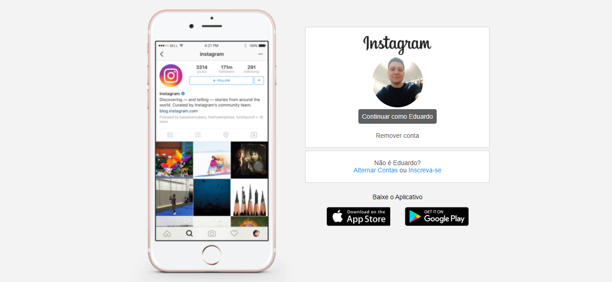

# Instagram Login

## Sobre o projeto.
Desenvolvimento da página de login do Instagram. Junto do login trago o meu perfil e com botões cinzas. Imagens ilustrativas em sua maior parte do projeto.

Data de conclusão: 09/10/2021

## Ferramentas e tecnologias usadas nesse projeto.
```js    
function InstagramLogin(Project) {
    const FrontEnd = `${HTML}, ${CSS}`;
};

``` 

<div align="center">



</div>

---

> - Autores: 
>   - [Eduardo Kayke](https://github.com/EduardoKayke "Perfil do Eduardo")

- [Voltar ao perfil do Github.](https://github.com/EduardoKayke "Perfil do Eduardo")

_Um dia seremos a tecnologia. Biohacking a própria evolução de nós mesmos._
